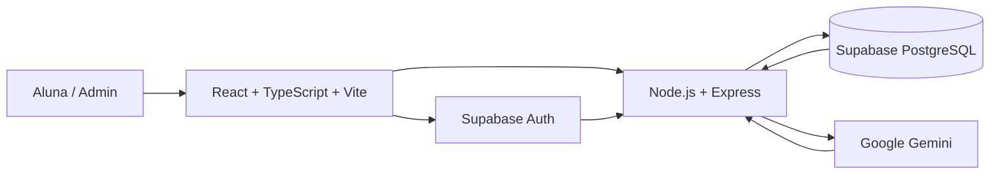

<div align="center">

# ✨ Karla Premium

### Plataforma Full Stack para acompanhamento, experiência digital e relacionamento com alunas

Aplicação web desenvolvida para centralizar a experiência digital das alunas da **Karla Karolynne**, reunindo autenticação, área exclusiva da aluna, painel administrativo, inteligência artificial, memória persistente de conversas e integração com o aplicativo oficial de treinos.

[](https://react.dev/)
[](https://www.typescriptlang.org/)
[](https://vite.dev/)
[](https://nodejs.org/)
[](https://expressjs.com/)
[](https://supabase.com/)
[](https://ai.google.dev/)

<br />

[🌐 Acessar aplicação](https://karla-premium.vercel.app) • [📂 Frontend](./frontend) • [⚙️ Backend](./backend) • [🗄️ Migrations](./supabase/migrations)

</div>

---

## 📌 Sobre o projeto

A **Karla Premium** é uma plataforma Full Stack criada para centralizar a experiência digital das alunas da personal trainer **Karla Karolynne**.

O projeto vai além de uma landing page. A aplicação reúne:

* autenticação;
* área exclusiva da aluna;
* perfil individual;
* dashboard;
* integração com aplicativo de treinos;
* assistente com inteligência artificial;
* memória persistente de conversas;
* API própria;
* banco de dados PostgreSQL;
* painel administrativo;
* autorização por perfis;
* autenticação multifator para administração;
* infraestrutura preparada para novos módulos.

A arquitetura separa claramente as responsabilidades entre **frontend, backend, autenticação, banco de dados, inteligência artificial e administração**.

> **Status:** 🚧 Projeto em desenvolvimento ativo. A estrutura Full Stack, autenticação, área da aluna, IA, memória de conversa, perfil, painel administrativo e MFA já estão implementados. Alguns módulos de acompanhamento ainda estão em evolução.

---

## 🎯 Objetivo

A Karla Premium foi projetada para oferecer uma experiência centralizada, segura e escalável para as alunas.

A plataforma permite:

* criar uma conta;
* autenticar-se com e-mail e senha;
* entrar utilizando Google;
* utilizar link mágico;
* recuperar a senha;
* manter sessão autenticada;
* acessar uma área exclusiva;
* consultar e atualizar o próprio perfil;
* acessar o aplicativo oficial de treinos;
* conversar com a IA da Karla;
* manter histórico de conversas;
* utilizar informações autorizadas do perfil para personalizar o contexto da IA;
* separar permissões de alunas e administradoras;
* administrar clientes e conversas;
* preparar a plataforma para avaliações, evolução, alimentação, feedbacks, transformações e novos conteúdos.

---

# 🧩 Funcionalidades

## 🔐 Autenticação

A autenticação é realizada com **Supabase Auth**.

### Métodos disponíveis

* Cadastro com e-mail e senha
* Login com e-mail e senha
* Google OAuth
* Magic Link
* Confirmação de e-mail
* Recuperação de senha
* Atualização de senha
* Sessão persistente
* Logout
* Proteção de rotas privadas

### Rotas principais

```text
/login
/cadastro
/recuperar-senha
/minha-conta
/admin
```

---

# 👩‍🎓 Área da aluna

A plataforma possui uma aplicação própria para as usuárias autenticadas.

A área da aluna atualmente possui:

* dashboard personalizado;
* saudação utilizando o nome da usuária;
* frase motivacional diária;
* resumo da jornada;
* cards de acompanhamento;
* acesso aos treinos;
* área de avaliações;
* acompanhamento de evolução;
* área de alimentação;
* IA da Karla;
* edição do perfil;
* navegação responsiva;
* menu mobile;
* logout.

Alguns indicadores ainda exibem estados vazios até que os módulos correspondentes sejam integrados aos dados reais da plataforma.

---

## 🏋️ Aplicativo oficial de treinos

O card **Meus Treinos** direciona a aluna para o aplicativo oficial utilizado pela Karla.

Isso permite manter a plataforma web como central de relacionamento e acompanhamento sem duplicar funcionalidades já existentes no aplicativo de treinamento.

---

# 👤 Perfil da aluna

Cada usuária autenticada possui um perfil individual.

Entre as informações utilizadas atualmente estão:

* nome completo;
* e-mail;
* telefone;
* data de nascimento;
* objetivo;
* restrições;
* informações pessoais relacionadas ao acompanhamento.

O frontend permite alterar somente os campos autorizados.

Informações sensíveis, como:

```text
role
```

não podem ser definidas pelo navegador.

A autorização administrativa é validada exclusivamente pelo backend.

---

# 🤖 IA da Karla

A plataforma possui uma assistente inteligente integrada diretamente à experiência da aluna.

O provedor atualmente utilizado é o **Google Gemini**.

A integração possui:

* prompt de sistema próprio;
* persona da Karla;
* contexto de horário;
* horário configurado para `America/Sao_Paulo`;
* continuidade de conversa;
* histórico recente;
* memória persistente;
* tratamento de erros do provedor;
* persistência das mensagens;
* personalização baseada no perfil da usuária;
* separação entre visitante e usuária autenticada.

O histórico enviado ao modelo é limitado para evitar crescimento indefinido do contexto.

O backend também possui o SDK da OpenAI instalado, deixando a arquitetura preparada para futuras integrações ou estratégias com múltiplos provedores.

---

# 🧠 Memória persistente do chat

A IA não funciona apenas como uma chamada isolada.

O projeto implementa uma estrutura de persistência para manter continuidade nas conversas.

## Fluxo simplificado

```text
Usuária
   │
   ▼
Frontend
   │
   ▼
POST /api/chat
   │
   ▼
Backend
   │
   ├── identifica cliente
   ├── identifica conversa
   ├── recupera histórico
   ├── salva mensagem
   ├── envia contexto ao Gemini
   ├── recebe resposta
   └── salva resposta
   │
   ▼
PostgreSQL / Supabase
```

### O processo inclui

1. geração ou recuperação de identificador de visitante;
2. hash do identificador antes de persistir no banco;
3. identificação ou criação do cliente;
4. identificação ou criação da conversa;
5. recuperação das mensagens recentes;
6. persistência da mensagem da usuária;
7. envio do contexto ao Gemini;
8. persistência da resposta da IA;
9. atualização do último contato.

---

# 🔗 Associação visitante → conta

Uma visitante pode conversar com a IA antes de possuir uma conta.

Depois que ela realiza login ou cadastro, a plataforma possui um fluxo de associação do histórico.

Endpoint:

```text
POST /api/auth/claim-visitor
```

Esse processo permite preservar as conversas anteriormente criadas e associá-las à conta autenticada.

---

# 🛡️ Painel administrativo

A plataforma também possui uma interface administrativa separada da área da aluna.

A navegação administrativa está estruturada para:

```text
Dashboard
Alunos
Treinos
Avaliações
Evolução
Alimentação
Feedbacks
Transformações
Conteúdo do site
IA da Karla
Configurações
```

A arquitetura permite evoluir cada módulo independentemente.

Nem todas essas seções possuem o mesmo nível de implementação nesta fase do projeto.

---

# 🔒 MFA e AAL2

O painel administrativo possui uma camada adicional de segurança.

Não basta estar autenticado.

Para utilizar as operações administrativas protegidas, a aplicação verifica:

```text
Sessão válida
      ↓
Bearer Token
      ↓
Usuário válido
      ↓
role = admin
      ↓
MFA
      ↓
AAL2
      ↓
Painel administrativo
```

A autorização administrativa não utiliza informações enviadas diretamente pelo navegador como fonte de confiança.

O backend valida a identidade e consulta o perfil correspondente no banco.

---

# 🏗️ Arquitetura



---

# 🧱 Camadas da aplicação

## Frontend

Responsável por:

* interface;
* autenticação;
* roteamento;
* área da aluna;
* painel administrativo;
* chat;
* perfil;
* experiência responsiva;
* comunicação com a API.

---

## Backend

Responsável por:

* API REST;
* validação de tokens;
* autenticação server-side;
* autorização;
* administração;
* persistência do chat;
* integração com Gemini;
* comunicação segura com Supabase;
* tratamento de erros.

---

## Supabase

Responsável por:

* PostgreSQL;
* autenticação;
* usuários;
* perfis;
* migrations;
* Row Level Security;
* funções SQL;
* triggers;
* persistência.

---

## Google Gemini

Responsável pela geração de respostas da **IA da Karla**.

---

# 🛠️ Tecnologias

## Frontend

* React 19
* TypeScript
* Vite 8
* React Router DOM
* Tailwind CSS 4
* Framer Motion
* Lucide React
* Swiper
* Supabase JavaScript Client
* ESLint

---

## Backend

* Node.js
* Express 5
* JavaScript ES Modules
* Supabase JavaScript Client
* Google GenAI SDK
* OpenAI SDK
* CORS
* dotenv
* Nodemon
* Node Test Runner

---

## Banco de dados

* PostgreSQL
* Supabase
* SQL
* Row Level Security
* Migrations
* Functions
* Triggers
* Constraints
* Indexes

---

## Inteligência Artificial

* Google Gemini
* Google GenAI SDK
* System Prompt customizado
* Histórico persistente
* Personalização por perfil
* Arquitetura preparada para múltiplos provedores

---

# 📁 Estrutura do projeto

```text
karla-premium/
│
├── backend/
│   │
│   ├── src/
│   │   ├── controllers/
│   │   ├── lib/
│   │   ├── middleware/
│   │   ├── routes/
│   │   ├── services/
│   │   └── server.js
│   │
│   ├── test/
│   ├── .env.example
│   ├── package.json
│   └── README.md
│
├── docs/
│   ├── PHASE_4_ADMIN_AUTH.md
│   └── PHASE_5_CLIENT_AUTH.md
│
├── frontend/
│   │
│   ├── public/
│   │
│   ├── src/
│   │   ├── assets/
│   │   ├── components/
│   │   ├── content/
│   │   ├── contexts/
│   │   ├── features/
│   │   │   ├── admin/
│   │   │   ├── auth/
│   │   │   ├── chat/
│   │   │   └── student/
│   │   ├── hooks/
│   │   ├── lib/
│   │   ├── services/
│   │   ├── styles/
│   │   ├── types/
│   │   ├── App.tsx
│   │   └── main.tsx
│   │
│   ├── .env.example
│   ├── DESIGN_SYSTEM.md
│   ├── package.json
│   └── README.md
│
├── supabase/
│   └── migrations/
│
├── .gitignore
├── LICENSE
└── README.md
```

---

# 🗄️ Banco de dados

O banco de dados utiliza **PostgreSQL através do Supabase**.

Sua evolução é controlada por migrations versionadas no repositório.

## Migrations atuais

```text
202608050001_initial_schema.sql

202608060002_grant_database_health_access.sql

202608070003_phase_4_admin_auth_memory.sql

202608080004_phase_5_client_auth_profile.sql

202608110005_student_role.sql
```

A estrutura possui recursos relacionados a:

* profiles;
* clients;
* roles;
* conversations;
* messages;
* usuários autenticados;
* visitantes;
* associação de visitantes;
* configurações;
* memória do chat;
* autenticação;
* autorização;
* RLS;
* índices;
* constraints.

---

# 🔐 Segurança

Segurança faz parte da arquitetura da Karla Premium.

Entre as medidas utilizadas estão:

* Supabase Auth;
* bearer tokens;
* validação server-side;
* rotas protegidas;
* autorização baseada em role;
* MFA;
* AAL2;
* Row Level Security;
* chaves privadas apenas no backend;
* variáveis de ambiente;
* CORS;
* allowlist de origens;
* normalização de origem;
* limite de payload;
* tratamento centralizado de erros;
* sanitização de logs;
* ocultação de chaves;
* hash de identificadores de visitantes;
* restrição dos campos atualizáveis;
* separação entre chave publicável e chave secreta.

O servidor limita o corpo JSON das requisições:

```text
20kb
```

---

## ⚠️ Segredos

Nunca adicione ao GitHub:

```text
SUPABASE_SECRET_KEY
GEMINI_API_KEY
tokens
senhas
credenciais privadas
```

A chave:

```text
VITE_SUPABASE_PUBLISHABLE_KEY
```

é utilizada pelo frontend porque é destinada ao cliente público.

A `SUPABASE_SECRET_KEY` deve permanecer exclusivamente no backend.

---

# 🔌 API

## Health Check

| Método | Endpoint               | Finalidade                       |
| ------ | ---------------------- | -------------------------------- |
| `GET`  | `/api/health`          | Verifica se a API está online    |
| `GET`  | `/api/health/database` | Verifica comunicação com o banco |

---

## Chat

| Método | Endpoint                            | Finalidade               |
| ------ | ----------------------------------- | ------------------------ |
| `POST` | `/api/chat`                         | Envia mensagem para a IA |
| `GET`  | `/api/chat/conversations`           | Lista conversas          |
| `GET`  | `/api/chat/history/:conversationId` | Recupera histórico       |

---

# 👤 Usuária autenticada

| Método  | Endpoint                  | Finalidade                          |
| ------- | ------------------------- | ----------------------------------- |
| `GET`   | `/api/me`                 | Retorna o próprio perfil            |
| `PATCH` | `/api/me`                 | Atualiza campos permitidos          |
| `POST`  | `/api/auth/claim-visitor` | Associa histórico visitante à conta |

Esses endpoints utilizam autenticação via:

```http
Authorization: Bearer <access_token>
```

---

# 🛡️ Administração

| Método  | Endpoint                       | Finalidade              |
| ------- | ------------------------------ | ----------------------- |
| `GET`   | `/api/admin/me`                | Valida a administradora |
| `GET`   | `/api/admin/dashboard`         | Dados do dashboard      |
| `GET`   | `/api/admin/clients`           | Lista clientes          |
| `GET`   | `/api/admin/clients/:id`       | Consulta cliente        |
| `PATCH` | `/api/admin/clients/:id`       | Atualiza cliente        |
| `GET`   | `/api/admin/conversations`     | Lista conversas         |
| `GET`   | `/api/admin/conversations/:id` | Consulta conversa       |
| `GET`   | `/api/admin/settings`          | Consulta configurações  |
| `PATCH` | `/api/admin/settings`          | Atualiza configurações  |

---

# 🚀 Executando localmente

## Pré-requisitos

Antes de executar o projeto, instale:

* Node.js
* npm
* Git

Também será necessário:

* projeto Supabase;
* credenciais Supabase;
* chave da API Gemini.

Para trabalhar com as migrations, recomenda-se a **Supabase CLI**.

---

# 1️⃣ Clonar o projeto

```bash
git clone https://github.com/joselysilva-dev/karla-premium.git
```

Entre na pasta:

```bash
cd karla-premium
```

---

# 2️⃣ Frontend

Entre na pasta:

```bash
cd frontend
```

Instale as dependências:

```bash
npm install
```

Crie o arquivo `.env` com base em:

```text
.env.example
```

Exemplo:

```env
VITE_API_URL=http://localhost:3001/api

VITE_SUPABASE_URL=https://seu-projeto.supabase.co

VITE_SUPABASE_PUBLISHABLE_KEY=sua_chave_publicavel
```

Execute:

```bash
npm run dev
```

A aplicação será disponibilizada normalmente em:

```text
http://localhost:5173
```

---

# 3️⃣ Backend

Abra outro terminal.

Entre na pasta:

```bash
cd backend
```

Instale as dependências:

```bash
npm install
```

Crie:

```text
.env
```

utilizando:

```text
.env.example
```

como referência.

Exemplo:

```env
GEMINI_API_KEY=sua_chave

GEMINI_MODEL=gemini-3.1-flash-lite

FRONTEND_URL=http://localhost:5173

ALLOWED_ORIGINS=

PORT=3001

NODE_ENV=development

SUPABASE_URL=https://seu-projeto.supabase.co

SUPABASE_SECRET_KEY=sua_chave_secreta
```

Execute em desenvolvimento:

```bash
npm run dev
```

Ou:

```bash
npm start
```

A API estará disponível em:

```text
http://localhost:3001
```

---

# 4️⃣ Banco de dados

Com a Supabase CLI configurada:

```bash
npx supabase link --project-ref SEU_PROJECT_REF
```

Depois:

```bash
npx supabase db push
```

Isso aplica as migrations pendentes ao projeto Supabase conectado.

> Revise sempre migrations antes de executá-las em produção.

---

# 📜 Scripts

## Frontend

| Comando           | Função            |
| ----------------- | ----------------- |
| `npm run dev`     | Desenvolvimento   |
| `npm run build`   | Build de produção |
| `npm run lint`    | ESLint            |
| `npm run preview` | Preview do build  |

---

## Backend

| Comando       | Função             |
| ------------- | ------------------ |
| `npm run dev` | Inicia com Nodemon |
| `npm start`   | Inicia com Node.js |
| `npm test`    | Executa testes     |

---

# ✅ Validação

Antes de publicar alterações importantes:

## Frontend

```bash
cd frontend
npm run lint
npm run build
```

## Backend

```bash
cd backend
npm test
```

Também é recomendado validar manualmente:

* cadastro;
* confirmação de e-mail;
* login;
* Google OAuth;
* Magic Link;
* recuperação de senha;
* perfil;
* área da aluna;
* chat;
* histórico;
* associação de visitante;
* bloqueio administrativo;
* MFA;
* AAL2;
* health check da API;
* health check do banco.

---

# 🌐 Deploy

O frontend está publicado na **Vercel**:

### 🔗 https://karla-premium.vercel.app

Em produção devem ser configurados corretamente:

```text
VITE_API_URL
VITE_SUPABASE_URL
VITE_SUPABASE_PUBLISHABLE_KEY
```

No backend:

```text
GEMINI_API_KEY
GEMINI_MODEL
FRONTEND_URL
ALLOWED_ORIGINS
PORT
NODE_ENV
SUPABASE_URL
SUPABASE_SECRET_KEY
```

Também é necessário configurar no Supabase:

* Site URL;
* Redirect URLs;
* confirmação de e-mail;
* Google OAuth;
* configurações do Magic Link;
* MFA administrativo.

---

# 📚 Documentação adicional

O projeto possui documentação técnica complementar.

### Administração, autenticação e memória

```text
docs/PHASE_4_ADMIN_AUTH.md
```

### Autenticação e perfil da aluna

```text
docs/PHASE_5_CLIENT_AUTH.md
```

### Design System

```text
frontend/DESIGN_SYSTEM.md
```

### Frontend

```text
frontend/README.md
```

### Backend

```text
backend/README.md
```

---

# 🧠 Conhecimentos aplicados

Durante o desenvolvimento da Karla Premium foram aplicados e praticados conceitos de:

### Frontend

* React
* TypeScript
* Componentização
* SPA
* React Router
* rotas protegidas
* responsividade
* UX
* formulários
* gerenciamento de sessão

### Backend

* Node.js
* Express
* API REST
* controllers
* routes
* middleware
* services
* tratamento de erros
* validação de autenticação

### Autenticação

* Supabase Auth
* Google OAuth
* Magic Link
* recuperação de senha
* bearer token
* autorização
* roles
* MFA
* AAL2

### Banco de dados

* PostgreSQL
* Supabase
* SQL
* migrations
* constraints
* indexes
* triggers
* funções
* Row Level Security

### Inteligência Artificial

* Google Gemini
* prompts de sistema
* contexto
* histórico
* persistência
* memória conversacional
* tratamento de falhas de provider

### Segurança

* proteção de segredos
* CORS
* autorização server-side
* MFA
* RLS
* sanitização de logs
* princípio do menor privilégio

### Engenharia de Software

* separação de responsabilidades
* arquitetura Full Stack
* estrutura modular
* versionamento
* documentação
* Git
* GitHub
* desenvolvimento incremental

---

# 🗺️ Roadmap

## Core

* [x] Estrutura Full Stack
* [x] Frontend React + TypeScript
* [x] Backend Node.js + Express
* [x] Supabase/PostgreSQL
* [x] Migrations versionadas

## Autenticação

* [x] Cadastro
* [x] Login
* [x] Google OAuth
* [x] Magic Link
* [x] Recuperação de senha
* [x] Sessão persistente
* [x] Rotas protegidas

## Área da aluna

* [x] Dashboard
* [x] Perfil
* [x] IA da Karla
* [x] Integração com aplicativo de treinos
* [ ] Dados reais de avaliações
* [ ] Evolução completa
* [ ] Alimentação
* [ ] Indicadores personalizados

## Inteligência Artificial

* [x] Gemini
* [x] Persona personalizada
* [x] Histórico recente
* [x] Persistência das mensagens
* [x] Memória de conversa
* [x] Associação visitante → conta
* [ ] Evoluir recursos personalizados
* [ ] Expandir testes da IA

## Administração

* [x] Painel administrativo
* [x] Role administrativa
* [x] MFA
* [x] AAL2
* [x] Dashboard
* [x] Clientes
* [x] Conversas
* [x] Configurações
* [ ] Gerenciamento completo de treinos
* [ ] Avaliações
* [ ] Evolução
* [ ] Alimentação
* [ ] Feedbacks
* [ ] Transformações
* [ ] Conteúdo do site

## Engenharia

* [x] Testes de backend
* [x] ESLint
* [x] TypeScript build
* [x] Health check
* [x] Database health check
* [ ] Ampliar cobertura de testes
* [ ] CI/CD
* [ ] Observabilidade
* [ ] Monitoramento
* [ ] Auditoria final de acessibilidade
* [ ] Revisão final de segurança para produção

---

# 🚧 Status

```text
████████████████░░░░ Desenvolvimento ativo
```

A Karla Premium já possui uma base funcional Full Stack e continuará recebendo novos módulos, integrações, ajustes de experiência e melhorias de arquitetura.

---

# ⚠️ Observações

Este é um projeto real em desenvolvimento.

Funcionalidades, arquitetura, banco de dados e interface podem ser modificados durante sua evolução.

A assistente de inteligência artificial funciona como recurso complementar da plataforma e não substitui acompanhamento profissional quando este for necessário.

Dados reais de usuárias, credenciais e informações privadas não são disponibilizados neste repositório.

---

# 📄 Licença

O arquivo `LICENSE` presente atualmente no repositório ainda não define uma licença pública específica para reutilização do código.

Portanto, antes de copiar, redistribuir ou reutilizar partes deste projeto, consulte a autora.

---

# 👩‍💻 Autora

## Josely Silva Lima

**Estudante de Engenharia de Software**
**Desenvolvedora Backend e Full Stack em formação**

Foco em:

```text
Backend
APIs
Banco de Dados
Full Stack
Cloud
Inteligência Artificial
Engenharia de Software
```

[](https://github.com/joselysilva-dev)

[](https://www.linkedin.com/in/joselysilvadev)

[](mailto:joselysilvadev@gmail.com)

---

<div align="center">

## ✨ Karla Premium

**Tecnologia, experiência e acompanhamento em uma plataforma criada para evoluir junto com o produto.**

Desenvolvido com arquitetura Full Stack, segurança, inteligência artificial e atenção aos detalhes.

</div>
